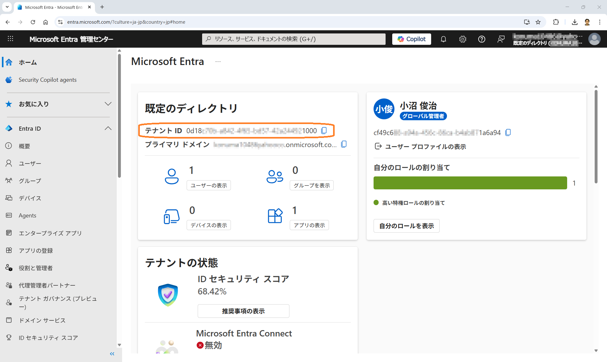

# 初期環境構築: Entra ID Free

## 目次

【工事中】

---

## 1. はじめに

【工事中】

---

## 2. テナント ID 取得

1. トップページ（ホーム）に表示されている「テナント ID」を取得します。
	

## 3. アプリケーション作成

### 3-1. Client ID 作成

1. 左ペインのメニューから「アプリの登録」を選択して、アプリの登録画面で「＋新規登録」をクリックします。

   

1. アプリケーションに必要な項目を入力して「登録」ボタンをクリックします。

   

   - 名前：例）ms-entra-handson
   - サポートされているアカウントの種類：シングル テナントのみ - {管理しているテナント名}
   - リダイレクト URI：
      - プラットフォーム：Web
      - URL：認可コードを受け取るエンドポイント
        - 例：Spring Boot がデフォルトで用意するエンドポイント）http://localhost:8080/login/oauth2/code/

1. 遷移先の画面に発行されている「アプリケーション (クライアント) ID」（形式：XXXXXXXX-XXXX-XXXX-XXXX-XXXXXXXXXXXX）を控えます。

   

### 3-2. Client secret 発行

1. 中央ペインのメニューから「証明書とシークレット」を選択し、「クライアント シークレット」タブから「＋新しいクライアント シークレット」ボタンをクリックします。

   

1. 画面右側からスライドしてきた「クライアントシークレットの追加」ウィンドウにて、項目を入力して「追加」ボタンをクリックします。

   
   
   - 説明：例）handson-secret
   - 有効期間：「推奨: 180 日 (6か月)」

1. 追加直後に発行されている 「値（Value）」 をコピーして控えます。

   

   - 「シークレット ID」ではなく、必ず「値」 の方をコピーします。一度画面を閉じると確認できず、二度と控えることができません。

### 3-3. API のアクセス許可（Scope）確認

- 中央ペインのメニューから「API のアクセス許可」を選択して、念のために、「Microsoft Graph ＞ User.Read: 委任済み (Delegated) 」が付いていることを確認します。

   

   - この値は Entra ID がユーザー情報の開示を許可することを意味しており、アクセストークンや ID トークンに、氏名などの属性情報（Claims）が含まれるようになります。
