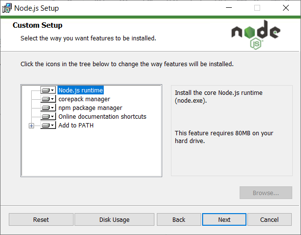
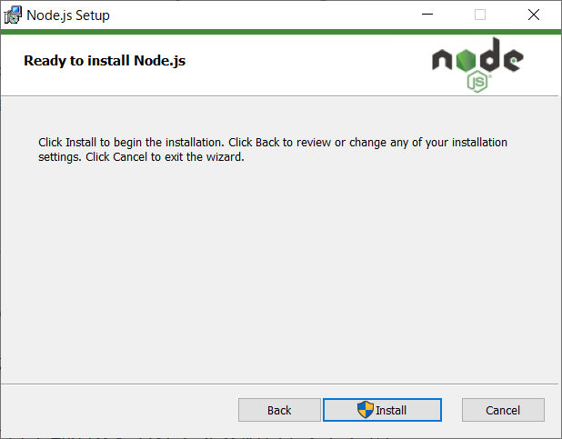

# 初期環境構築: Node.js on Windows

## 目次

1. [はじめに](#1-はじめに)
2. [前提条件](#2-環境構築)
	- 2.1. [インストーラーの取得](#21-インストーラーの取得)
	- 2.1. [Node.js をインストール](#22-nodejs-をインストール)
3. [インストール確認](#3-インストール確認)

---

## 1. はじめに

Windows で JavaScript 実行環境を必要とするハンズオン向けに、Node.js をインストールして実行環境を準備します。

**利用している環境**

- Windows 10 Professional
- Windows PowerShell 5.1.19041.5737
- Node.js v22.15.0

---

## 2. 環境構築

Node.js のインストール方法は、WinGet を使った CLI ベースのインストール方法と、Windows インストーラー（MSI）を使った GUI ベースのインストール方法が Node.js の公式サイトで案内されていますが、GUI ベースのインストール手順で進めます。

### 2.1. インストーラーの取得

Node.js 公式サイトから Windows インストーラー（MSI）をダウンロードします。

1. Node.js の公式サイト「[Node.js — どこでもJavaScriptを使おう](https://nodejs.org)」にアクセスし、ダウンロードページに遷移します。<br>
	
	- https://nodejs.org

2. ダウンロードページの前半部は WinGet を使った CLI ベースのインストール方法の案内のため、後半部の案内を対象にアーキテクチャと OS を選択して「Windows インストーラー(.msi)」をクリックします。<br>
	

3. 「名前を付けて保存」ダイアログでは保存先のフォルダを確認してから「保存」ボタンをクリックしてダウンロードを開始します。<br>
	

4. エクスプローラーで Node.js のインストーラー（.msi）がダウンロードされたことを確認します。<br>
	

### 2.2. Node.js をインストール

ダウンロードした Windows インストーラー（MSI）を実行してインストールします。

1. エクスプローラーでダウンロードした Windows インストーラーをダブルクリックして、インストーラーを実行します。<br>
	

2. セットアップウィザードが立ち上がったら「Next」ボタンをクリックして進めます。<br>
	

3. ライセンス利用許諾契約を確認して、「I accept the terms in the License Agreement.」にチェックを入れて「Next」ボタンをクリックして進めます。<br>
	

4. インストール先のフォルダ選択はデフォルトのままで「Next」ボタンをクリックして進めます。<br>
	

5. インストールする機能の選択はデフォルトのままで「Next」ボタンをクリックして進めます。<br>
	

6. ネイティブモジュールをコンパイルする必要はないため、デフォルトのままチェックは付けず「Next」ボタンをクリックして進めます。<br>
	

7. インストールの準備が整いましたので、「Install」ボタンをクリックしてインストールを開始しします。<br>
	

8. 「このアプリがデバイスに変更を加えることを許可しますか？」のダイアログが表示されたら「はい」をクリックして進めます。

9. インストールが開始されましたので、しばらくそのまま待ちます。<br>
	

10. 以下が表示されたら無事にインストールが完了したので「Finish」ボタンをクリックしてセットアップウィザードを閉じます。<br>
	

## 3. インストール確認

Node.js がインストールできたことを確認します。

1. Windows のスタートメニューの「N」セクションに「Node.js」が登録されたことを確認します。<br>
	

2. 続いて Windows のスタートメニュー「W」セクションから「Windows Powershell」を選択して起動します。<br>
	

3. Windows Powershell が起動したら、node、npm、npx の各コマンドのバージョンを確認してインストールされていることを確認します。（バージョン番号は一例です）
	```
	PS > node -v

	v22.15.0
	```
	```
	PS > npm -v

	10.9.2
	```
	```
	PS > npx -v

	10.9.2
	```
