# 初期環境構築: WSL 環境 on Windows 10

## 目次

- [1. はじめに](./setup-wsl-on-windows10#1-%E3%81%AF%E3%81%98%E3%82%81%E3%81%AB)
- [2 WSL インストール](./setup-wsl-on-windows10#2-wsl-%E3%82%A4%E3%83%B3%E3%82%B9%E3%83%88%E3%83%BC%E3%83%AB)
	- 2.1 WSL と Ubuntu のインストール
	- 2.2 Ubuntu の初回起動後にやっておくべき推奨事項
		- 2.2.1 Ubuntu パッケージ更新と便利ツールインストール
		- 2.2.2 Windows Terminal インストール
- 3 WSL アンインストール
	- 3.1 Ubuntu のアンインストール
	- 3.2 WSL まで完全にアンインストール
- 4 運用 Tips
	- 4.1 WSL の動作が遅くなったり固まった場合の対処

---

## 1. はじめに

各種ミドルウェアのハンズオンは Ubuntu の OS 環境を対象に実施を進めるため、Windows PC をお使いの場合には、Windows で Linux のディストリビューションを実行できる WSL の環境構築から着手します

**利用している環境**

- Windows 10 Professional
- WSL 2.4.11.0
- Ubuntu 24.04.2 LTS

---

## 2. WSL インストール

### 2.1. WSL と Ubuntu のインストール

1. Windows のスタートメニュー「W > Windows PowerShell > Windows PowerShell」から「Windows PowerShell」を起動します 
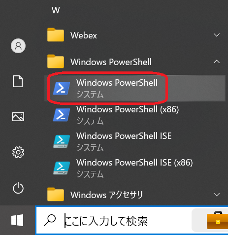
2. 「`> wsl -l -v`」コマンドで WSL がインストールされていないことを確認します 
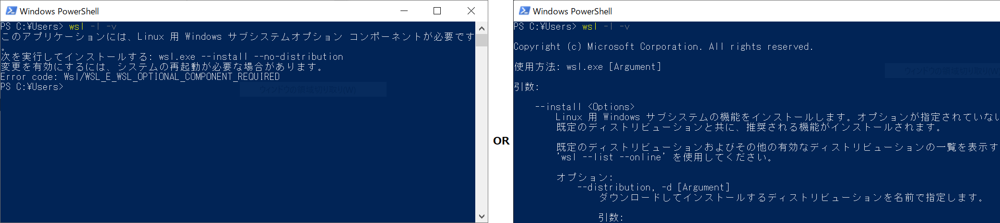
3. 「`> wsl --install`」コマンドで WSL をインストールします （途中「このアプリがデバイスに変更を加えることを許可しますか？」のダイアログが表示された場合には、「はい」押下で進めます） 
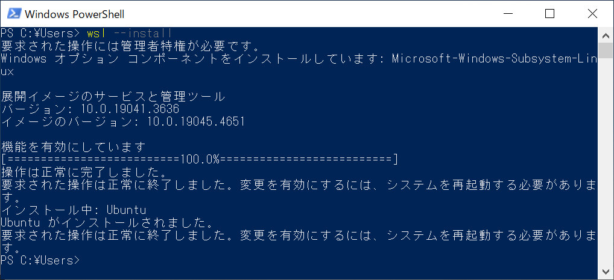
4. WSL と一緒にデフォルトのディストリビューション（Ubuntu）がインストールされたら Windows を再起動します
5. Windows が起動しなおしたら、Windows のスタートメニューに新たに「U > Ubuntu」が登録されているので起動します 
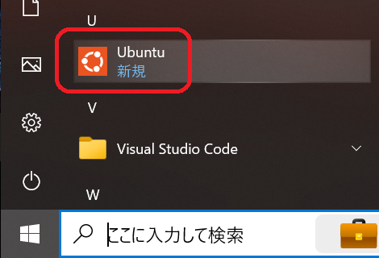
6. 起動すると「Installing, this may take a few minutes…」のメッセー表示とともにインストール処理が開始します
7. メッセージ表示をしばらく待つと、Ubuntu へログインするアカウントのユーザ名とパスワード登録を求められるのでそれぞれ入力します 

8. アカウントの登録が終わると、WSL 上で動作する Ubuntu が利用可能となります

### 2.2. Ubuntu の初回起動後にやっておくべき推奨事項

#### 2.2.1. Ubuntu パッケージ更新と便利ツールインストール

1. ディストリビューションにデフォルトで入っているパッケージは古い可能性があるためアップデートします
2. これから実施するハンズオンで入れておくと便利なツールを事前にインストールすることをお勧めします （ミドルウエア自体や開発言語は、各ミドルウエアのハンズオンによる手順が重要となるため、ここではそれらのインストールはお勧めしておりません）

	- 上記 apt コマンドでインストールできない場合、apt update、および apt upgrade が完了していない可能性があるので、先にパッケージのアップデートを済ませます
	- インストールをお勧めしているパッケージ
		- jq：フィールド指定で値を抽出したり、集計や加工など JSON データを便利に操れるツール
		- unzip：zipファイルの解凍コマンド
		- tree：ディレクトリやファイルをツリー構造で表示できるツール
		- httpie：コマンドライン HTTP クライアントの「HTTPie」

#### 2.2.2. Windows Terminal インストール

利用者それぞれの好みになりますが、WSL の Ubuntu にログインして使うターミナルとして「Windows Terminal」の利用をお勧めします 
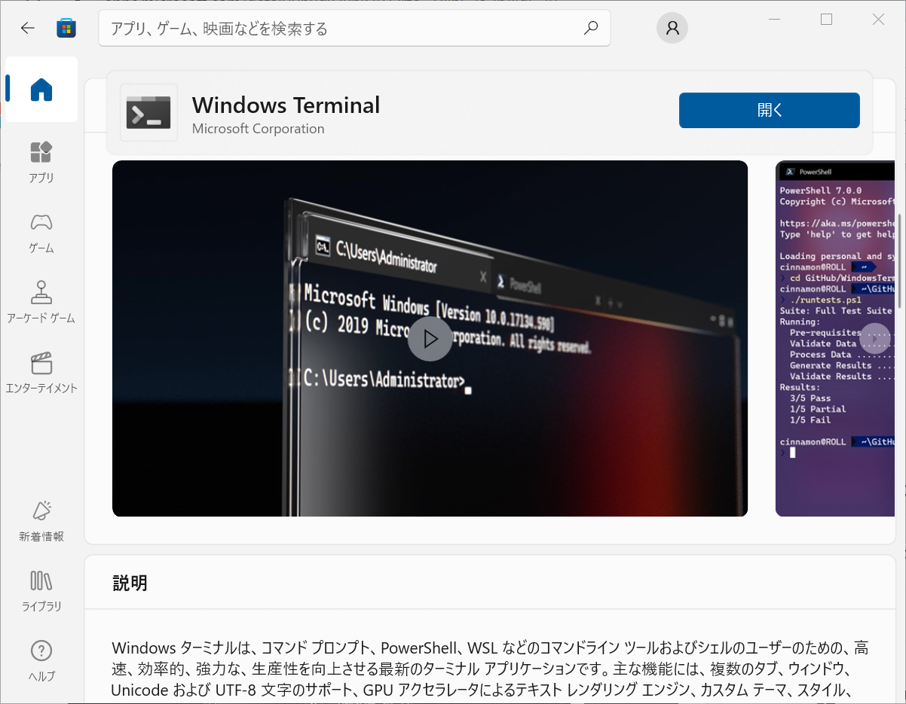

---
## 3. WSL アンインストール

### 3.1. Ubuntu のアンインストール

1. Windows のスタートメニュー「W > Windows PowerShell > Windows PowerShell」から「Windows PowerShell」を起動します 

2. 「`> wsl -l -v`」コマンドで WSL の稼働状態を確認し、実行中（STATE = Running）であれば「`> wsl --shutdown`」にて停止（STATE = Stopped）します 
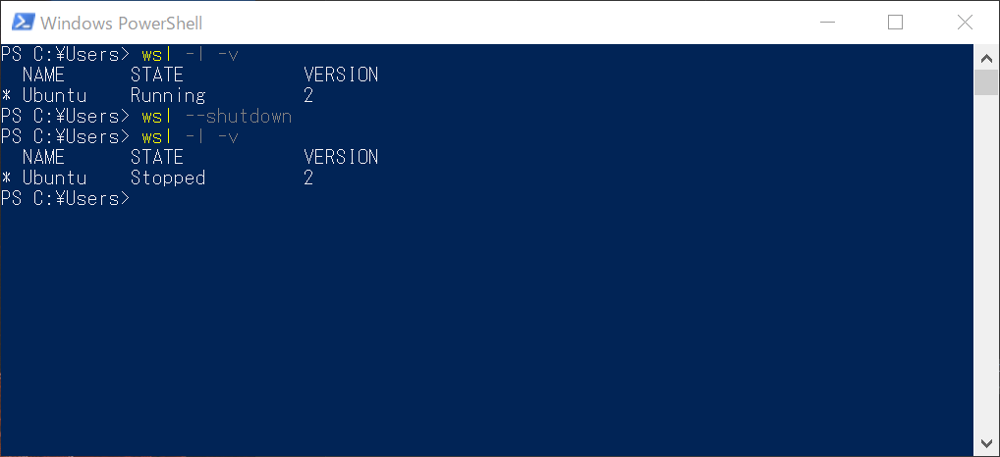
3. 「`> wsl --unregister Ubuntu`」コマンドにて Ubuntu をアンインストールします 
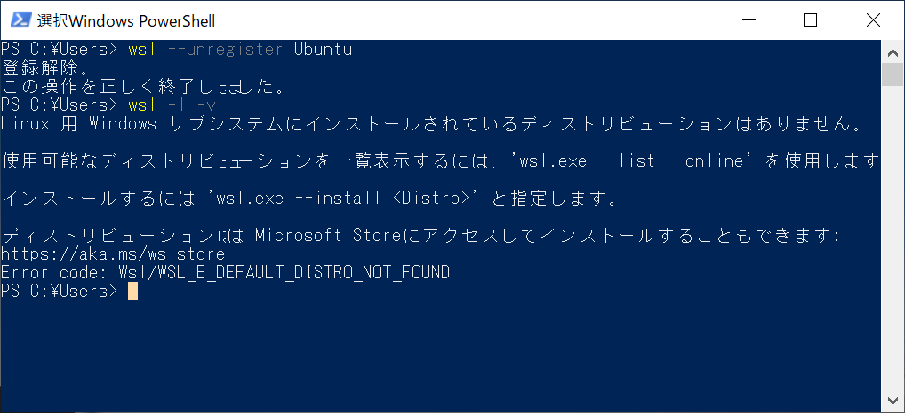
4. Ubuntu のアンインストールはここまでの手順で完了です
	- 真っさらな Ubuntu 環境を再度用意したい場合は、前述の「Hands-on: 初期環境構築: WSL 環境 on Windows | WSL インストール」へ戻り実行します
	- 完全に WSL をアンインストールしたい場合は、後続の「Hands-on: 初期環境構築: WSL 環境 on Windows | WSL まで完全にアンインストール」を続けて実行します

### 3.2. WSL まで完全にアンインストール

1. Windows のスタートメニュー「U > Ubuntu」で右クリックし、表示されたショートカットメニューから「アンインストール」を選びます 
（「このアプリとその関連情報がアンインストールされます。」のダイアログが表示された場合には、「アンインストール」押下で進めます） 
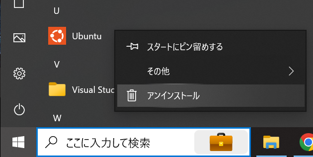
2. 「Linux 用 Windows サブシステム」も取り除くため、Windows のスタートメニューから「設定」を起動します 
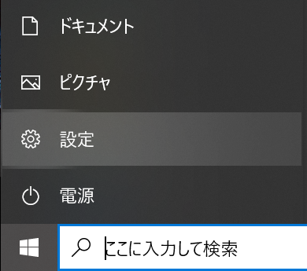
3. 設定が起動したら「システム」を選択します 
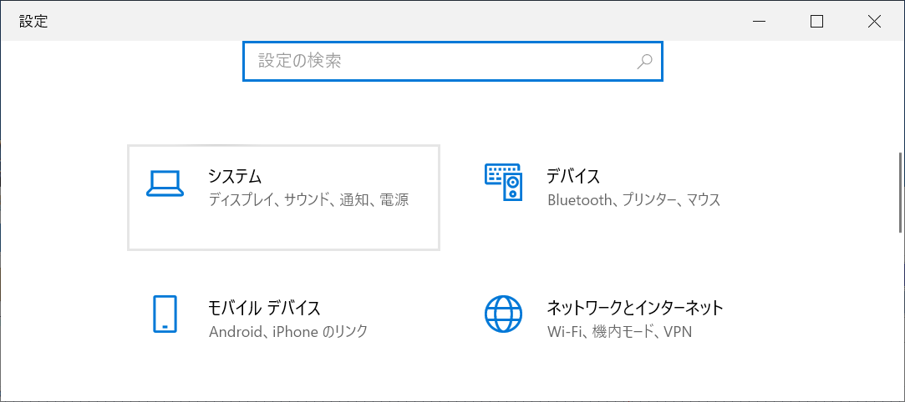
4. システムが起動したら左ペインから「オプション機能」を選択し、右ペインは最下部にスクロールして「Windows のその他の機能」を選択します 
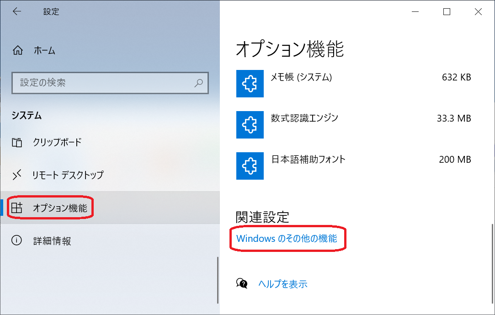
5. 「Windows の機能の有効化または無効化」が起動したら機能一覧より、「Linux 用 Windows サブシステム」に付いているチェックを外し無効化し「OK」ボタンを押下します 
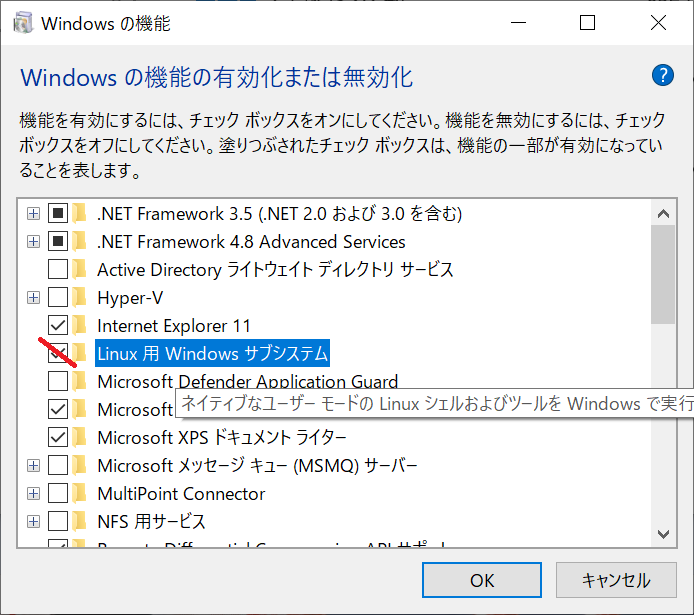
6. 必要な変更処理が終わりPCの再起動を求められたら「今すぐ再起動」を押下し Windows を再起動します 
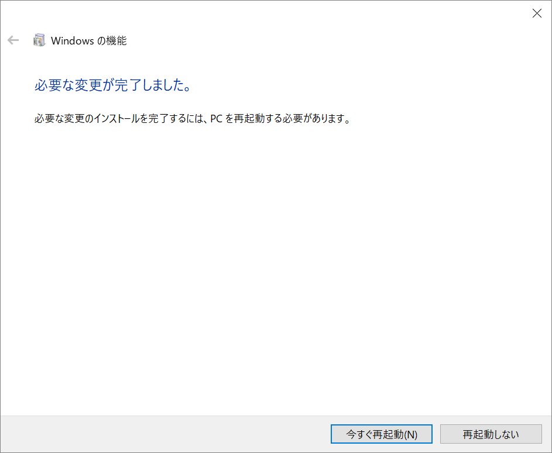
7. Windows が起動しなおしたら、アンインストールは完了です

---

## 4. 運用 Tips

### 4.1. WSL の動作が遅くなったり固まった場合の対処

複数のコンテナや Kubernetes を稼働させ続けていると、WSL (Ubuntu) の動作が遅くなったり固まることがありますが、その際には WSL のプロセスを落とします

1. Windows タスクバーの右クリックで表示するショートカットメニューより「タスク マネージャー」を選択します 
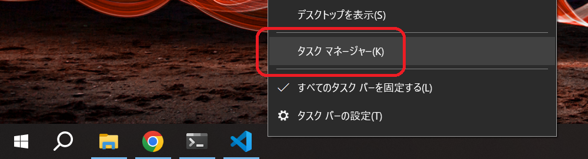
2. 表示した「タスク マネージャー」ポップアップ画面でバックグラウンドプロセスより「Windows Subsystem for Linux Service」を選択し「タスクの終了」ボタンを押下します 
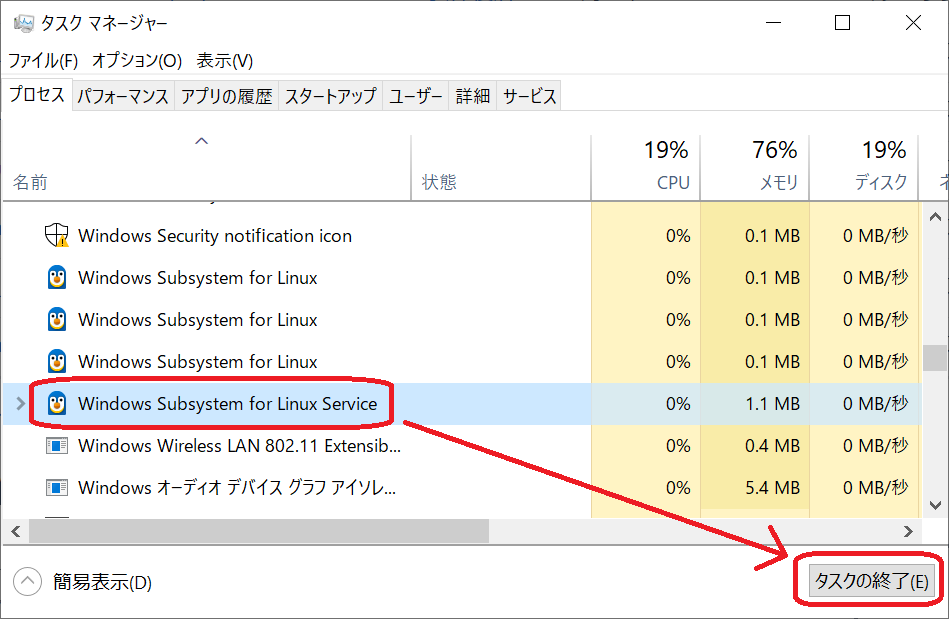
3. WSL のプロセスが強制終了されるので、再度 Windows のスタートメニューから「Ubuntu」を起動しなおし、ログインしたらコンテナや Kubernetes を起動し直しハンズオンを再開します
